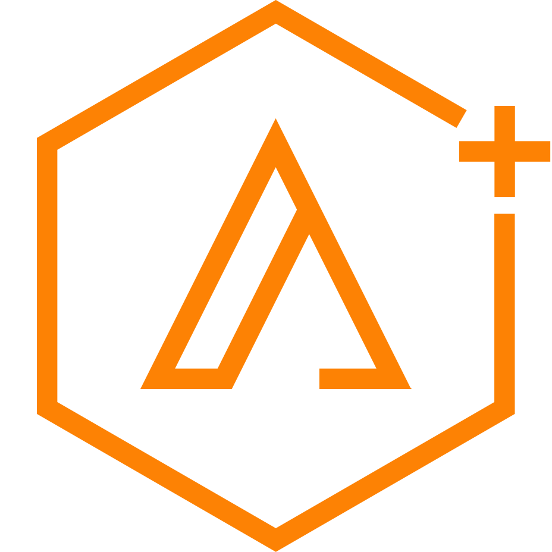

[](https://www.gnu.org/licenses/gpl-3.0)

<!-- PROJECT LOGO -->
<br />
<p align="center">
  <a href="https://github.com/github_username/repo">
    
  </a>
  <h3 align="center">
    <div>艾普拉斯數位顧問股份有限公司</div>
    <div>Aplus Digital Consulting Co., Ltd.</div>
  </h3>

  <p align="center">We create digital experience</p>
</p>

<!-- PROJECT TITLE -->
# Frontend Production Gulp Tasks Template

<!-- TABLE OF CONTENTS -->
## Table of Contents

* [About the Project](#about-the-project)
  * [Built With](#built-with)
* [Getting Started](#getting-started)
  * [Prerequisites](#prerequisites)
    * [Node.js](#node.js)
    * [npm](#npm)
    * [Gulp](#gulp)
    * [Git](#git)
    * [Visual Studio Code](#visual-studio-code)
    * [Nunjucks](#nunjucks)
  * [Installation](#installation)
* [Usage](#usage)
* [Deployment](#deployment)
* [Documentation](#documentation)
  * [File Structure](#file-structure)
  * [Gulp Task](#gulp-task)
  * [Nunjucks Program Syntax](#nunjucks-program-syntax)
* [Authors and acknowledgment](#authors-and-acknowledgment)
* [License](#license)
* [Contact](#contact)

<!-- ABOUT THE PROJECT -->
## About The Project

前端切版 Gulp 自動化任務空白範本  

### Built With

* [Node.js](https://nodejs.org/en/) - v10.16.3 - A JavaScript runtime built on Chrome's V8 JavaScript engine
* [HTML5 Boilerplate](https://html5boilerplate.com/) - v8.0.0 - The web’s most popular front-end template
* [jQuery](https://jquery.com/) - v3.6.0 - jQuery is a fast, small, and feature-rich JavaScript library
* [Modernizr](https://modernizr.com/) - v3.11.7 - Modernizr tells you what HTML, CSS and JavaScript features the user’s browser has to offer
* [Normalize.css](https://necolas.github.io/normalize.css/) - v8.0.1 - A modern, HTML5-ready alternative to CSS resets
* [Nunjucks](https://mozilla.github.io/nunjucks/) - A rich and powerful templating language for JavaScript
* [Gulp](https://gulpjs.com/) - v4.0.2 - A toolkit to automate & enhance your workflow
* [@babel/core](https://www.npmjs.com/package/@babel/core/) - v7.12.16 - Babel compiler core
* [browser-sync](https://www.browsersync.io/) - v2.26.14 - Time-saving synchronised browser testing
* [del](https://github.com/sindresorhus/del/) - v6.0.0 - Delete files and directories using globs
* [path](https://nodejs.org/api/path.html) - The path module provides utilities for working with file and directory paths
* [gulp-autoprefixer](https://github.com/sindresorhus/gulp-autoprefixer/) - v7.0.1 - Prefix CSS with Autoprefixer
* [gulp-babel](https://www.npmjs.com/package/gulp-babel/) - v8.0.0 - Use next generation JavaScript, today, with Babel
* [gulp-clean-css](https://github.com/scniro/gulp-clean-css/) - v4.3.0 - Gulp plugin to minify CSS
* [gulp-dependents](https://github.com/thomas-darling/gulp-dependents/) - v1.2.5 - Gulp plugin that tracks dependencies between files and adds any files that depend on the files currently in the stream
* [gulp-eslint](https://www.npmjs.com/package/gulp-eslint/) - v6.0.0 - A gulp plugin for ESLint
* [gulp-filter](https://github.com/sindresorhus/gulp-filter/) - v6.0.0 - Enables you to work on a subset of the original files by filtering them using glob patterns
* [gulp-foreach](https://www.npmjs.com/package/gulp-foreach/) - v0.1.0 - Send each file in a stream down its own stream
* [gulp-if](https://github.com/robrich/gulp-if/) - v3.0.0 - A ternary gulp plugin: conditionally control the flow of vinyl objects
* [gulp-imagemin](https://github.com/sindresorhus/gulp-imagemin/) - v7.1.0 - Minify PNG, JPEG, GIF and SVG images with imagemin
* [gulp-nunjucks-render](https://github.com/carlosl/gulp-nunjucks-render/) - v2.2.3 - Render Nunjucks templates
* [gulp-plumber](https://www.npmjs.com/package/gulp-plumber/) - v1.2.1 - Prevent pipe breaking caused by errors from gulp plugins
* [gulp-rename](https://github.com/hparra/gulp-rename/) - v2.0.0 - Gulp plugin to rename files easily
* [gulp-replace](https://www.npmjs.com/package/gulp-replace/) - v1.0.0 - A string replace plugin for gulp
* [gulp-sass](https://github.com/dlmanning/gulp-sass/) - v4.1.0 - Sass plugin for Gulp
* [gulp-sourcemaps](https://github.com/gulp-sourcemaps/gulp-sourcemaps/) - v3.0.0 - Sourcemap support for gulpjs
* [gulp-uglify](https://github.com/terinjokes/gulp-uglify/) - v3.0.2 - Minify JavaScript with UglifyJS3
* [gulp-watch](https://github.com/floatdrop/gulp-watch/) - v5.0.1 - File watcher that uses super-fast chokidar and emits vinyl objects

<!-- GETTING STARTED -->
## Getting Started

要取得並執行本地端副本，請按照以下步驟操作。

### Prerequisites

#### Node.js

> Web Site：[https://nodejs.org/en/](https://nodejs.org/en/)  
> Download：[https://nodejs.org/en/download/](https://nodejs.org/en/download/)  
> Document：[https://nodejs.org/en/docs/](https://nodejs.org/en/docs/)

* Node.js 是在後端運行 JavaScript 程式碼的環境。
* 安裝時務必選擇全部組件，包括勾選 `Add to Path`。
* 安裝完成後，開啟命令提示字元，輸入 `node -v` ，如果安裝正確，會顯示安裝的 Node.js 版本。

```sh
# Node.js 版本查詢
C:\Users\tang.chen>node -v
v10.16.0
```

---

#### npm

* npm 是 Node Package Manager 的簡稱，是 Node.js 套件管理工具，可以透過此工具下載各式各樣的 Node.js 套件來使用。
* npm 在 Node.js 安裝時就順帶安裝好了。
* 安裝完 Node.js 後，開啟命令提示字元，輸入 `npm -v` 可確認安裝的 npm 版本。

```sh
# npm 版本查詢
C:\Users\tang.chen>npm -v
6.9.0
```

---

#### Gulp

> Web Site：[https://gulpjs.com/](https://gulpjs.com/)  
> Quick Start：[https://gulpjs.com/docs/en/getting-started/quick-start/](https://gulpjs.com/docs/en/getting-started/quick-start/)

* 將開發流程中讓人痛苦或耗時的任務自動化，從而減少開發過程中所浪費的時間，創造更大的價值。

```sh
# 安裝全域 Gulp CLI
npm install --global gulp-cli
```

---

#### Git

> Web Site：[https://git-scm.com/](https://git-scm.com/)  
> Download：[https://git-scm.com/downloads/](https://git-scm.com/downloads/)  
> Document：[https://git-scm.com/doc/](https://git-scm.com/doc/)  
> 管理工具：[Git for Windows](https://gitforwindows.org/)  
> 管理工具：[TortoiseGit](https://tortoisegit.org/)  
> 管理工具：[SourceTree](https://www.sourcetreeapp.com/)  
> 參考文件：[30 天精通 Git 版本控管](https://github.com/doggy8088/Learn-Git-in-30-days/blob/master/zh-tw/README.md)

* Git為分散式版本控制系統。
* 完全不需要伺服器端的支援就可以運作版本控制，每個人本地端都有一份完整的儲存庫副本。
* 每次提交版本變更時，都僅提交到本地的儲存庫而已，提交速度快，不需網路連線。
* 沒有「權限控管」，每個成員都能把儲存庫複製 (clone) 回來，也可以在本地提交變更。唯一能設定的權限是存取上層儲存庫(upstream repository)或遠端儲存庫(remote repository)的權限。
* 若需要與他人交換變更後的版本，可以透過「合併」的方式進行，Git 擁有非常強悍的合併追蹤（merge tracing）能力。
* 要合併多人的版本，你只要有存取共用儲存庫(shared repository)的權限或管道即可。
* 安裝完 Git 後，需要設定"使用者名稱"及"電子郵件"，每次 Git 的提交會使用這些資訊，而且提交後不能再被修改。

```sh
# 設定使用者名稱
git config --global user.name "公司帳號"

# 設定電子郵件
git config --global user.email "公司email"
```

---

#### Visual Studio Code

> Web Site：[https://code.visualstudio.com/](https://code.visualstudio.com/)  
> Download：[https://code.visualstudio.com/Download/](https://code.visualstudio.com/Download/)  
> Document：[https://code.visualstudio.com/docs/](https://code.visualstudio.com/docs/)  
> 繁體中文語言套件：[Chinese (Traditional) Language Pack for Visual Studio Code](https://marketplace.visualstudio.com/items?itemName=MS-CEINTL.vscode-language-pack-zh-hant)  
> Sass格式化套件：[Beautify](https://marketplace.visualstudio.com/items?itemName=HookyQR.beautify)

* Visual Studio Code 是一套跨平台（Windows、OS X、Linux）的 IDE，支援多種程式語言。
* 安裝完成後，可至 Extensions 安裝團隊開發之必要套件：
  * 中文(繁體)語言套件 - [Chinese (Traditional) Language Pack for Visual Studio Code](https://marketplace.visualstudio.com/items?itemName=MS-CEINTL.vscode-language-pack-zh-hant)
  * Sass 格式化套件 - [Beautify](https://marketplace.visualstudio.com/items?itemName=HookyQR.beautify)
* 需要調整 VS Code 的設定值，以符合團隊的開發規則及自動格式化邏輯。

```sh
# VS Code 設定
{
    "editor.renderWhitespace": "boundary",
    "editor.formatOnSave": true,
    "html.format.wrapLineLength": 160,
    "editor.fontSize": 16
}
```

---

#### Nunjucks

> Web Site：[https://mozilla.github.io/nunjucks/](https://mozilla.github.io/nunjucks/)  
> VS Code Extension：[Nunjucks Template](https://marketplace.visualstudio.com/items?itemName=eseom.nunjucks-template)

* 豐富、強大的JavaScript樣板語言。
* 可模組化網頁上的元件。
* 安裝完 Nunjucks Template 的 VS Code Extension 後，需要調整套件及 VS Code 的設定值，以符合團隊的開發及格式化規則。


> [~\assets\languages\configuration.json](./configurations/vscode/Nunjucks%20Template/assets/languages/configuration.json)  
> [~\assets\syntaxes\njk.json](./configurations/vscode/Nunjucks%20Template/assets/syntaxes/njk.json)  
> [~\assets\syntaxes\njk-html.json](./configurations/vscode/Nunjucks%20Template/assets/syntaxes/njk-html.json)  
> _"~"代表套件安裝目錄 %SystemDrive%\Users\\\<username\>\\.vscode\extensions\eseom.nunjucks-template-0.2.0_

```sh
# VS Code 設定
{
    "files.associations": {
        "*.tmpl": "njk",
        "*.part": "njk"
    },
    "emmet.includeLanguages": {
        "njk": "html"
    }
}
```

### Installation
 
1. 複製儲存庫

```sh
# 複製儲存庫
git clone http://aplus-develop:8080/tfs/APLUS/Aplus.Boilerplate.HTML/_git/Aplus.Boilerplate.HTML.Gulp
```
2. 安裝 npm 套件
```sh
# 安裝 npm 套件
npm install
```

<!-- USAGE EXAMPLES -->
## Usage

開啟命令提示字元，並移至儲存庫目錄內的 src 目錄，執行 `gulp` 指令啟動自動化任務，同時會自動啟動瀏覽器以檢視網頁內容。

```sh
# 開發模式
gulp
```

_更多詳細資訊，請參考 [Documentation](#Documentation)。_

<!-- Deployment -->
## Deployment

開啟命令提示字元，並移至儲存庫目錄內的 src 目錄，執行 `gulp build` 指令啟動自動化建置任務，最終交付的檔案將產生到 dist 目錄內。

```sh
# 發行模式
gulp build
```

<!-- Documentation -->
## Documentation

### File Structure
```sh
# Gulp
├── dist  (產製最終 HTML 結果的儲存目錄)
├── src  (切版原始檔目錄)
├── .babelrc  (babel 套件設定檔)
├── .browserslistrc  (autoprefixer 套件設定檔)
├── .eslintrc  (eslint 套件設定檔)
├── .nvmrc
├── gulpfile.js  (Gulp Task 執行檔)
├── logo.png
├── package-lock.json
├── package.json  (Node 套件設定檔)
└── README.md  (說明文件檔)
```
```sh
# HTML production source code
src
├── _layouts
│   └── _layout.tmpl
├── _macros
├── _partials
├── _variables
├── content
│   ├── css
│   │   ├── _mixins
│   │   │   ├── _breakpoints.scss
│   │   │   ├── _clearfix.scss
│   │   │   ├── _fonts.scss
│   │   │   ├── _gradients.scss
│   │   │   ├── _placeholder.scss
│   │   │   ├── _retina.scss
│   │   │   └── _triangles.scss
│   │   ├── _variables
│   │   │   ├── _colors.scss
│   │   │   ├── _others.scss
│   │   │   └── _widths.scss
│   │   ├── _browserUpgrade.scss
│   │   ├── _default.scss
│   │   ├── _forms.scss
│   │   ├── _mixins.scss
│   │   ├── _print.scss
│   │   ├── _variables.scss
│   │   ├── layout.scss
│   │   ├── main.scss
│   │   └── normalize.scss
│   ├── images
│   │   ├── touch
│   │   │   ├── icon-192x192.png
│   │   │   └── icon-192x192.png
│   ├── js
│   │   ├── main.js
│   │   └── plugins.scss
│   └── vendor
│       ├── jquery-3.6.0.js
│       ├── jquery-3.6.0.min.js
│       ├── jquery-3.6.0.min.map
│       └── modernizr-3.11.7.min.js
├── browserconfig.xml
├── favicon.ico
├── index.njk
├── robots.txt
├── site.json
├── tile-wide.png
└── tile.png
```

### Gulp Task
[TODO]

### Nunjucks Program Syntax
```sh
# 定義區塊



```
```sh
# 定義變數


```
```sh
# 定義 Macro

  <div>{{ message }}</div>

```
```sh
# 套用 Layout Page

```
```sh
# 套用區塊

  <div>內容</div>


# 套用區塊(移除前後空白)

  <link rel="stylesheet" href="./content/css/styles.min.css">


# 套用區塊(保留原內容)

  {{ super() }}
  <div>內容</div>

```
```sh
# 套用 Partial

```
```sh
# 套用 Macro

{$ popups.delete('Are you sure?') $}
```
```sh
# 匯入變數檔

```
```sh
# 輸出變數
<div>{{ data.title }}</div>
<div class="{{ 'is-active' if data.isActive === true }}">內容</div>

# 輸出根目錄相對路徑


# 輸出 HTML 內容
內容</div>' | safe }}" title="">
```
```sh
# for 迴圈


  <div>{{ item.title }}</div>




  <div>Use {{ amount }} of {{ name }}</div>

```
```sh
# if 判斷式

  <div>I am hungry</div>

  <div>I am tired</div>

  <div>I am good!</div>



  <div>I am happy *and* hungry; both are true.</div>



  <div>I am either happy *or* hungry; one or the other is true.</div>

```
```sh
# 取得索引值
loop.index: the current iteration of the loop (1 indexed)
loop.index0: the current iteration of the loop (0 indexed)
loop.revindex: number of iterations until the end (1 indexed)
loop.revindex0: number of iterations until the end (0 based)
loop.first: boolean indicating the first iteration
loop.last: boolean indicating the last iteration
loop.length: total number of items


<div>{{ loop.index }}</div>

```

## Authors and acknowledgment

* **Tang Chen** - *Initial work*
* **Chieh Ruan**

<!-- LICENSE -->
## License

Copyright © 2021 [Aplus Digital Consulting Co., Ltd.](http://www.aplus-digital.com/) All rights reserved.

<!-- CONTACT -->
## Contact

Aplus Digital Consulting Co., Ltd. - [@aplus](http://www.aplus-digital.com/contact)

Project Link: [http://aplus-develop:8080/tfs/APLUS/Aplus.Boilerplate.HTML/_dashboards](http://aplus-develop:8080/tfs/APLUS/Aplus.Boilerplate.HTML/_dashboards)